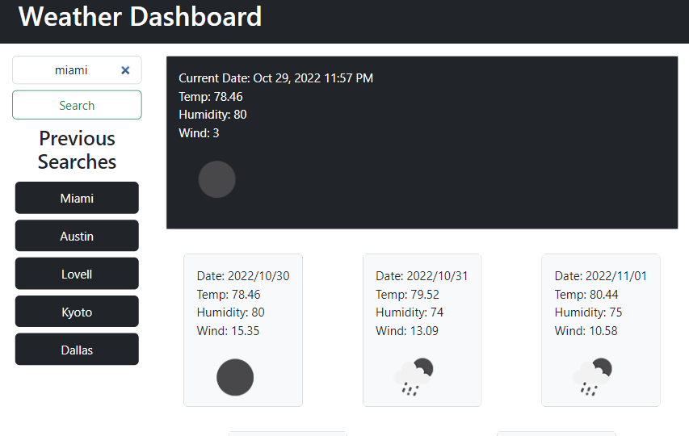

# Weather App

This is a Weather Dashboard using OpenWeatherMaps API. This app will show the current weather and 5 day forecast as a result of a users search. This app uses only vanilla Javascript and uses Bootstrap with styling with no custom CSS file. This apps has a search history feature to store previous searches.

## Installation

N/A 

## Usage

Find deployed application here https://iskry.github.io/WeatherApp/ 

## Contributing
Pull requests are welcome. For major changes, please open an issue first to discuss what you would like to change.

## License
[MIT](https://choosealicense.com/licenses/mit/)